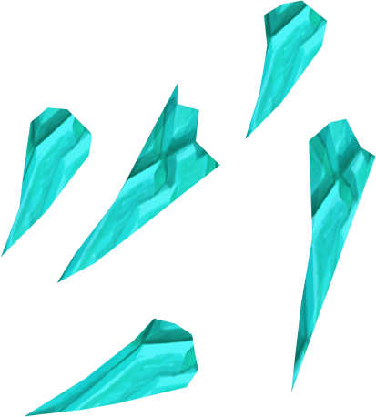

	
	 
    <h1 align="center">🧩 Fragmentor  </h1>
    
Solana Program to fragment NFTs into small NFTs, then do the opposite process and claim back the original NFT</a>

---

### 😎 Features

- Fragment or split an NFT into multiple NFTs, these NFTs can also be fragmented into multiples NFTs...
- Built with [Anchor](https://www.anchor-lang.com/) and some [Metaplex](https://www.metaplex.com/) tools such as Solita and Amman.

A lot is still missing, but we will get there!

### 🎁 Demo

**Note**: You can try the frontend app build with NextJS by running `pnpm dev:app` from the root.

### ❇️ Deployment

Program is currently only deployed on devnet as `FRAGFu59MRwy5KeEMnbzsUPa2JkwLVsaP7WbhF2r2Yh`

### 📜 To-do

- [ ] Write docs.
- [ ] Backend to split an image into multiple images, representing fragments, graphically, of the original NFT image.

MIT License